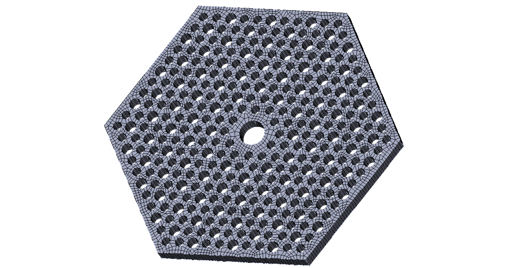
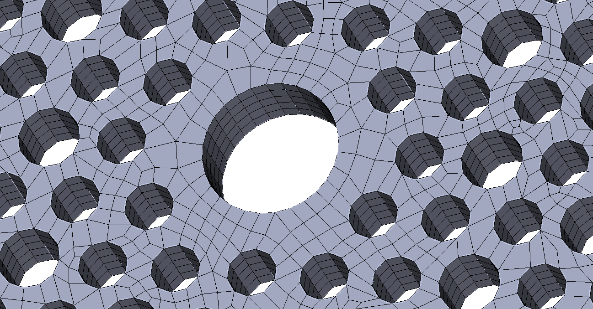
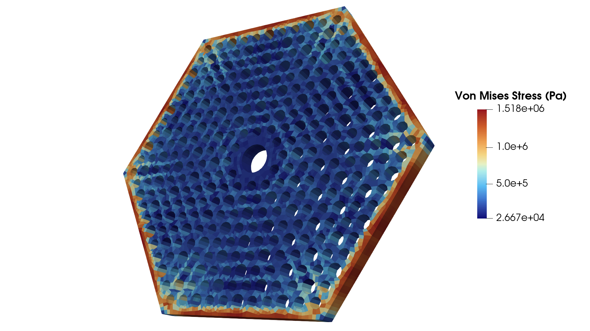
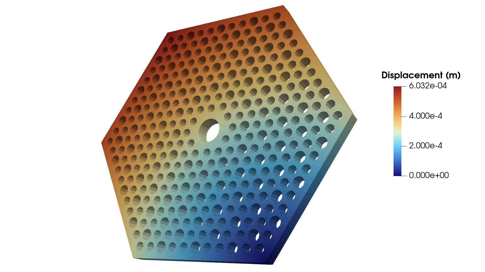
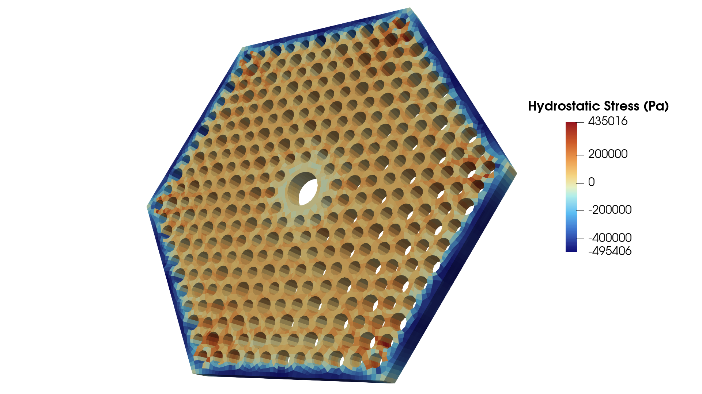

# Modular High-Temperature Gas-Cooled Reactor (MHTGR) Monolith Coupled FEA

This repository documents a coupled thermo-mechanical Finite Element Analysis (FEA) of an IG-110 nuclear-grade graphite fuel monolith. The simulation models steady-state heat distribution and thermal expansion stress using the MOOSE Framework.

## Technical Stack & Workflow
* **CAD Modeling:** SolidWorks (`cad/monolith.SLDPRT`, `cad/monolith.STEP`)
* **Mesh Generation:** Coreform Cubit (`meshes/monolith.cub5`) — Structured 8-node Hexahedral (HEX8) mesh
* **FEA Solver:** MOOSE Framework (`simulation/monolith.i`) — Fully coupled Heat Conduction & Tensor Mechanics
* **Post-Processing:** ParaView (`postprocessing/monolith_render.pvsm`)

## Mesh Topology
A structured hexahedral mesh was built around the internal cooling channels and fuel pin arrays to ensure high gradient accuracy and fast numerical convergence.

| Global Mesh View | Zoomed Channel Detail |
| :---: | :---: |
| <a href="images/monolith_cubit_mesh.png"></a> | <a href="images/monolith_cubit_mesh_zoomed.png"></a> |

* **Element Type:** HEX8 (Structured Brick)
* **Total Element Count:** **18,430 elements**
* **Mesh Quality:** **Average Scaled Jacobian > 0.81**

## Governing Physics & Boundary Conditions

### 1. Thermal Conduction
* **Volumetric Heat Source:** **5e6 W/m³** applied to fuel hole boundaries.
* **Convective Cooling:** $h =$ **2,000 W/(m²·K)**, $T_{\text{bulk}} =$ **600 K** applied to coolant channel walls.
* **Material Properties:** Thermal Conductivity $k =$ **9,000 / T W/(m·K)** for IG-110 Graphite.

### 2. Mechanical Expansion
* **Elastic Modulus ($E$):** **10 GPa**
* **Poisson's Ratio ($\nu$):** **0.14**
* **Thermal Expansion Coeff ($\alpha$):** **4.5e-6 / K**
* **Kinematic Constraints:** Isostatic 3-2-1 point-constraint scheme (`pt1`, `pt2`, `pt3`) to eliminate 6 rigid-body modes without inducing artificial thermal stresses.

## Results & Discussion

| Variable | Result Visualization | Peak Value & Physical Interpretation |
| :--- | :---: | :--- |
| **Temperature** | <a href="images/monolith_paraview_temp.png"></a> | **662 K** — Peak thermal accumulation occurs along the uncooled exterior perimeter, while convective cooling channels maintain lower internal core temperatures (~608 K). |
| **Von Mises Stress** | <a href="images/monolith_paraview_vonmises.png"></a> | **1,518,163 Pa (~1.52 MPa)** — Peak stresses remain well below the ultimate tensile strength of IG-110 (~25 MPa). |
| **Displacement** | <a href="images/monolith_paraview_disp.png"></a> | **6.03e-04 m (0.603 mm)** — Unidirectional thermal expansion relative to the fixed 3-2-1 anchor point, producing maximum deflection at the unconstrained top-left corner. |
| **Hydrostatic Stress** | <a href="images/monolith_paraview_hydro.png"></a> | **+0.44 MPa (Tension) / -0.50 MPa (Compression)** — Bounds the full volumetric stress state, highlighting internal core tension (+435,016 Pa) prone to micro-cracking versus outer edge compression (-495,406 Pa). |

## Repository Structure

```text
.
├── cad/
│   ├── drawings/
│   │   ├── monolith_drawing.pdf
│   │   └── monolith_drawing.SLDDRW
│   ├── monolith.SLDPRT
│   └── monolith.STEP
├── images/
│   ├── monolith_cad_drawing.png
│   ├── monolith_cubit_mesh_zoomed.png
│   ├── monolith_cubit_mesh.png
│   ├── monolith_paraview_disp.png
│   ├── monolith_paraview_hydro.png
│   ├── monolith_paraview_temp.png
│   └── monolith_paraview_vonmises.png
├── meshes/
│   ├── monolith.cub5
│   ├── monolith.e
│   └── monolith.jou
├── postprocessing/
│   └── monolith_render.pvsm
├── simulation/
│   └── monolith.i
├── .gitignore
├── LICENSE
└── README.md
```

## Prerequisites

To run the simulation from scratch, you will need:
* **MOOSE Framework:** A working installation of the MOOSE framework. Please follow the [official MOOSE Getting Started Guide](https://mooseframework.inl.gov/getting_started/index.html) to set up your environment.
* **ParaView:** Required for visualizing the `.e` output files.
* **Coreform Cubit (Optional):** Only required if you wish to regenerate the mesh from the `.jou` script.

## Simulation Workflow

This project is built on an automated CAD-to-solution pipeline. To reproduce the analysis from scratch, follow these steps:

1. **CAD Export (SolidWorks)**
   * The base geometry was modeled in SolidWorks (`cad/monolith.SLDPRT`) and exported as a standard STEP file (`cad/monolith.STEP`).

2. **Mesh Generation (Coreform Cubit)**
   * Open Coreform Cubit and change your working directory to the `meshes/` folder.
   * Run the automated journal script to import the CAD, mesh the volume, assign boundary sets, and export the Exodus mesh:
     ```cubit
     playback "monolith.jou"
     ```
   * *Output: `monolith.e`*
   * *Note: A pre-meshed Cubit session (`monolith.cub5`) and the exported mesh (`monolith.e`) are included in the repository. If you do not have a Cubit license, you can skip this step and proceed directly to the FEA solve.*

3. **FEA Solve (MOOSE Framework)**
   * Ensure your MOOSE environment is active. If you are using a custom MOOSE application, compile it in the repository root (e.g., using `make -j 4`).
   * From the root of the repository, execute the simulation using the relative path to the input file:
     ```bash
     mpiexec -n 4 ./<your_app_name>-opt -i simulation/monolith.i
     ```
   * *(Note: If you are relying on standard MOOSE physics, you can also point this command to the built-in `combined-opt` executable).*
   * *Output: `monolith_out.e` and `monolith_out.csv`*

4. **Post-Processing (ParaView)**
   * Open ParaView, go to **File > Load State...**, and select `postprocessing/monolith_render.pvsm`.
   * When prompted for data files, select **"Search files under specified directory"** and point ParaView to your local `simulation/` folder.
   * This automatically loads the dataset along with pre-configured color scales, legends, and camera views for `temperature`, `displacement`, `vonmises_stress`, and `hydrostatic_stress`.

---

**Author:** Barik Boley — B.S. Mechanical Engineering  
**Contact:** barik.boley@gmail.com | [linkedin.com/in/barik-boley](https://www.linkedin.com/in/barik-boley/)