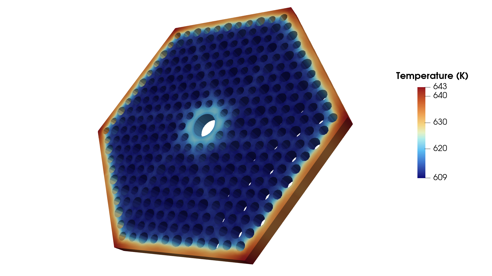

# High-Temperature Gas-Cooled Reactor (HTGR) Monolith Coupled FEA

This repository documents a coupled thermo-mechanical Finite Element Analysis (FEA) of an IG-110 nuclear-grade graphite fuel monolith. The simulation models steady-state heat distribution and thermal expansion stress using the MOOSE Framework.

---

## Technical Stack & Workflow
* **CAD Modeling:** SolidWorks (`cad/monolith.SLDPRT`, `cad/monolith.STEP`)
* **Mesh Generation:** Coreform Cubit (`meshes/monolith.cub5`) — Structured 8-node Hexahedral (HEX8) mesh
* **FEA Solver:** MOOSE Framework (`inputs/monolith.i`) — Fully coupled Heat Conduction & Tensor Mechanics
* **Post-Processing:** ParaView (`images/`)

---

## Mesh Topology
A structured hexahedral mesh was built around the internal cooling channels and fuel pin arrays to ensure high gradient accuracy and fast numerical convergence.

| Global Mesh View | Zoomed Channel Detail |
| :---: | :---: |
|  |  |

* **Element Type:** HEX8 (Structured Brick)
* **Total Element Count:** **18,430 elements**
* **Mesh Quality:** **Average Scaled Jacobian > 0.81**

---

## Governing Physics & Boundary Conditions

### 1. Thermal Conduction
* **Volumetric Heat Source:** **5e6 W/m³** applied to fuel hole boundaries.
* **Convective Cooling:** $h =$ **2,000 W/(m²·K)**, $T_{\text{bulk}} =$ **600 K** applied to coolant channel walls.
* **Material Properties:** Thermal Conductivity $k =$ **9,000 / T W/(m·K)** for IG-110 Graphite.

### 2. Mechanical Expansion
* **Elastic Modulus ($E$):** **10 GPa**
* **Poisson's Ratio ($\nu$):** **0.14**
* **Thermal Expansion Coeff ($\alpha$):** **4.5e-6 / K**
* **Kinematic Constraints:** Isostatic 3-2-1 point-constraint scheme (`pin_pt1`, `pin_pt2`, `pin_pt3`) to eliminate 6 rigid-body modes without inducing artificial thermal stresses.

---

## Results & Discussion

| Variable | Result Visualization | Peak Value & Physical Interpretation |
| :--- | :---: | :--- |
| **Temperature** |  | **643 K** — Maximum thermal accumulation occurs in central webs between uncooled fuel channels. |
| **Von Mises Stress** |  | **972,662 Pa (~0.97 MPa)** — Peak stresses remain well below the ultimate tensile strength of IG-110 (~25 MPa). |
| **Displacement** |  | **5.97e-04 m (0.597 mm)** — Symmetric radial outward expansion (visualized with exaggerated displacement scaling). |

---

## Repository Structure

```text
.
├── cad/
│   ├── drawings/
│   │   ├── monolith_drawing.pdf
│   │   └── monolith_drawing.SLDDRW
│   ├── monolith.SLDPRT
│   └── monolith.STEP
├── images/
│   ├── monolith_cad_drawing.png
│   ├── monolith_mesh.png
│   ├── monolith_mesh_zoomed.png
│   ├── monolith_temp.png
│   ├── monolith_vonmises.png
│   └── monolith_disp.png
├── inputs/
│   └── monolith.i
├── meshes/
│   ├── monolith.cub5
│   └── monolith.e
├── .gitignore
└── README.md
```

## How to Run

1. **Prerequisites:** Installed MOOSE framework executable (e.g., `combined-opt` or custom application).
2. **Execute Simulation:**
   ```bash
   mpiexec -n 4 ./monolith_analysis-opt -i inputs/monolith.i
   ```
3. **View Results:** Load the output Exodus mesh (`inputs/monolith_out.e`) directly into ParaView.

---

**Author:** Barik Boley — B.S. Mechanical Engineering  
**Contact:** barik.boley@gmail.com | linkedin.com/in/barik-boley